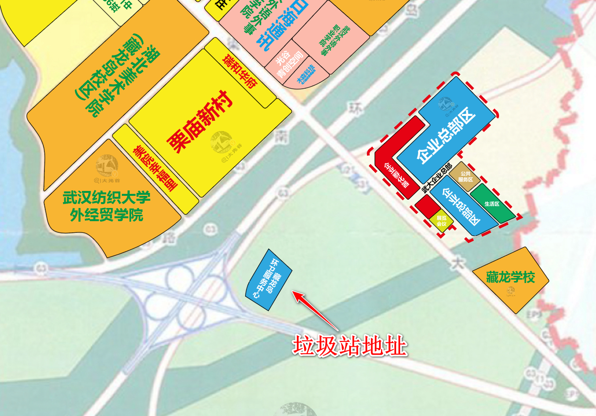

<center><font size=6 color=red>藏龙岛垃圾场维权群信息公示页</font></center>
<center><font size=4 color=#FF00FF>藏龙岛垃圾场维权群</font></center>
<!-- TOC -->

- [1. 相关发布信息](#1-相关发布信息)
- [2. 反馈渠道](#2-反馈渠道)
- [3. 我们在行动](#3-我们在行动)
    - [3.1. 拉横幅、联名签字计划安排](#31-拉横幅联名签字计划安排)
- [4. 加入我们](#4-加入我们)
    - [4.1. 藏龙岛垃圾场维权群三群](#41-藏龙岛垃圾场维权群三群)
- [5. 捐款渠道](#5-捐款渠道)
    - [5.1. 维权群收款码](#51-维权群收款码)
- [6. 范例](#6-范例)
    - [6.1. 留言反馈范例](#61-留言反馈范例)
    - [6.2. 邮件反馈范例](#62-邮件反馈范例)

<!-- /TOC -->
<br><br>

根据政府文件显示，江夏区自然资源和规划局就**藏龙岛环卫服务中心**工程规划总平面图进行了公示。项目位于绕城高速东侧，栗庙陵园附近。总用地面积<font color=Red size=5>25884.45平方米</font>，建筑面积7898平方米。公示时间为2023-01-09至<font color=Red size=5>2023-01-20</font>。




<font color=#008000 size=4>
公示期内是我们可以争取的唯一时间窗口！一旦公示完结，就会动工开建！<br>
在此，呼吁岛内居民朋友为自己的生活栖息地和下一代的健康生活，勇敢地站出来维护自己的合法权益！！
</font>


# 1. 相关发布信息
- [武汉江夏经济开发区管理委员会江夏区藏龙岛环卫服务中心工程规划总平面图公示](http://gtghj.wuhan.gov.cn/jx/pc-1046-335799.html)【官网-武汉市江夏区自然资源和规划局】
- [武汉江夏经济开发区管理委员会江夏区藏龙岛环卫服务中心工程规划总平面图公示](http://www.jiangxia.gov.cn/xxgk_22343/zc/qtwj/gsgg_22348/202301/t20230109_2127299.shtml)【官网-武汉市江夏区人民政府】
- [总面积2.5万平！藏龙岛这里将建环卫服务中心！](https://mp.weixin.qq.com/s/5h5nQGj7vLQ-Iw99nIxy5w)【微信公众号-藏龙岛资讯圈】
- [藏龙岛环卫服务中心工程规划总平面图公示，具体用来做什么？](https://mp.weixin.qq.com/s/hYMX8rLntHtoiFDS7GwUAQ)【微信公众号-藏龙岛岛报】
- [藏龙岛环卫服务中心工程规划总平面图公示！](https://www.toutiao.com/w/1754643863936072/?app=news_article&timestamp=1673457709&use_new_style=1&share_token=C36590E0-88B5-4567-9F20-5B74552D6886&tt_from=weixin&utm_source=weixin&utm_medium=toutiao_ios&utm_campaign=client_share&wxshare_count=1&source=m_redirect)【今日头条头条号-大光谷】


# 2. 反馈渠道
- 【电话】
    - 规划公示联系电话：027-87912260郑工
    - 市长热线：12345
- 【小程序】
    - 武汉市民热线12345
    - 大武汉城市留言板
- 【邮件】
    - 湿地公约秘书处邮箱：ramsar@ramsar.org
    - 湿地国际（也是湿地公约伙伴组织）官方邮箱：post@wetlands.org
    - 世界自然保护联盟（也是湿地公约伙伴组织）中国官方邮箱：info.china@iucn.org
- 其他渠道

    [留言和邮件内容范例见下文](#6-范例)


# 3. 我们在行动
**目前相关的行动计划正在筹备中，如拉横幅、联名签字等，本页面会随时更新最新计划安排，希望大家积极参与。**

## 3.1. 拉横幅、联名签字计划安排
```
请各小区委托人员19：00到金地湖山镜领横幅悬挂，领签字版文件（周五晚上18：00收集并寄送到公示地址），领宣传文件，为游行抗议做准备。

今天17：00-20：00在小区出入口
明天早上07：00-09：00一定要加大宣传

重要：暂定周五20：00收一版，统一用EMS寄送公示地址（每个小区有个代表收集汇总）。
```

# 4. 加入我们

## 4.1. 藏龙岛垃圾场维权群三群


*本群由岛民自发聚集，用于共享信息和组织活动宣传等，希望大家都能积极参与。*

# 5. 捐款渠道

## 5.1. 维权群收款码


*出于自愿原则，有人的出人，有力的出力，为维护我们的家园贡献自己的一份力量*

**此收款码用于维权相关的活动资金，由群里财会专业的美女负责管理。活动资金的收支明细一般会在每晚进行公示，公示信息也会同步更新到此页面**


# 6. 范例
## 6.1. 留言反馈范例
标题：反对建设江夏区藏龙岛环卫服务中心联名书
```
尊敬的领导：
首先感谢在百忙之中，愿意倾听我们百姓的真实心声，也希望各位领导在了解该事项后能够给予我们片区居民真切的关怀和帮助。
我们是武汉市江夏区藏龙岛栗庙路片区的居民，作为普通的民众，我们在藏龙岛栗庙路片区工作生活，为了在房价如此之高的今天拥有一套属于自己的房子，老百姓拿出全家三代的积蓄还要贷款。可是最近不知道是出于何种原因的考量，经江夏区自然资源和规划局审查公示，规划在藏龙岛栗庙路附近建藏龙岛环卫服务中心（25,884.45平米的大型的垃圾中转站），引起周边小区全体业主的极度悲愤。
在这两天中，我们多次打12345市长热线、向市规划局经开区分局、开发区管委会、信访办投诉并未得到明确答复。在此，我们表示坚决反对垃圾中转站建在藏龙岛栗庙路附近。理由有以下几点：
第一：垃圾站项目不科学，依据不足。根据《城镇环境卫生设施设置标准》，垃圾转运站运行时有大量垃圾收集车及大型垃圾转运车进出，故垃圾转运站所在地道路应宽敞、车流量均衡，与城市交通干道连接简洁等，使垃圾收集车及转运车的运营有较好的通行条件，对转运站附近道路的交通秩序不产生明显的影响。目前藏龙岛只有一条主干道栗庙路，连接沪渝高速，每天路上有各种大货车大卡车，工程运输车，栗庙路上7个小区居民出行都是靠这条主要干道，垃圾中转站建设后再加上不断运行的垃圾运输车，整个栗庙路将造成交通堵塞，水泄不通；
第二：垃圾站选址不适当，距离多个小区直线距离才1.5公里。附近有栗庙社区、长投绿城兰园、金地湖山境、龙苑兰岸、保利清能西海岸等小区，有美院、纺织大学、武汉外语外事、武汉体育学院等众多大学，有藏龙一小、藏龙三小（建设中）、二中（建设中）等众多中小学，大量垃圾车出入非常影响近200,000居民及小朋友的出行安全，严重干扰正常的交通。华中师范大学学者在《城市环境与城市生态》（2012年6月第25卷3期）发表的学术论文《上海市某生活垃圾中转站污染特征》论文中，可以看出中转站与周边的空气环境息息相关，直接影响到空气质量，在转运生活垃圾过程中不可避免的向外排泄污水、污气，污水长期沉淀于地下后形成永久性污染源几十年都无法清除。危害附近居民及中小学生的身心健康，其垃圾腐臭味还会危害居民的神经系统，机器在作业过程中产生的音波直接影响居民的正常休息；
第三：垃圾场及转运站规划需要远离动植物保护区。规划地点附近直线1.6公里还有一个国家级的生态保护区藏龙岛湿地公园，根据2022年11月06日湖北武汉第十四届《湿地公约》呼吁，推进湿地保护、修复、管理以及合理和可持续利用的立法和执法，采取湿地保护和修复措施，以应对社会、经济和环境挑战。国家林业和草原局副局长谭光明说，“武汉宣言”是一份凝聚各方共识、展示全球意愿的重要文件，向世界宣告了中国加强生态文明建设、推进湿地保护事业高质量发展的决心和责任。《湿地公约》秘书长穆松达·蒙巴说，“武汉宣言”的通过，展现了各缔约方对湿地保护的高度重视和创新举措。藏龙岛是属于湿地保护的范围，允许建设垃圾中转站将会对湿地产生不可逆转的环境影响。
综上，该项目对周围环境、民生的消极影响是巨大的。作为该项目附近居民，我们呼吁请党和政府倾听人民的诉求并为人民做主!现藏龙岛小区栗庙路片区居民强烈要求:公示规划主管部门审批同意文件；公示环境影响评价文件，藏龙岛环卫服务中心项目规划，停止在国家级的生态保护区藏龙岛湿地附近建设任何垃圾处理设施的考虑，请政府还我们一片绿水青山，让普通民众能够看到美丽中国的国策在我们身边得到如实的贯彻与执行!
此致，最强烈的期盼!

藏龙岛栗庙路片区居民

2023年1月11日
```

## 6.2. 邮件反馈范例
邮件标题：`Need your help to protect CangLong Island National Wetland Park`

邮件内容如下：
```
Dear Convention's Secretariat：

    We know that at the 14th Conference of the Parties, 146 Parties including China and 55 observer organizations signed the International Convention on Wetlands on 22 November 2022. The theme of the conference is "Cherish Wetlands, Harmonious Coexistence between man and Nature".
    However, at the beginning of 2023, in Wuhan, where the meeting was held, a national-level wetland public park CangLong Island National Wetland Park will be destroyed. Because a garbage collection center covering 25,884.45 square meters will be built next to the beautiful wetland site.This planned garbage collection center is only 1.3km away as the direct line.About 500 tons of garbage will be disposed of daily and at least 170 garbage trucks will be parked there. This will inevitably damage the surrounding air, soil and groundwater. This new waste treatment center in Wuhan, will have a huge impact on the surrounding environment of the wetland. In severe cases, groundwater will be damaged, oxygen-rich ions in the air will be affected, heavy metals will suddenly exceed the standard, and wetland native animals and migratory birds will be damaged.
	As residents here, we like this wetland park very much, and we don't want it to be destroyed. Therefore, we firmly oppose the plan to build a garbage dump canter. We hope you can help us to prevent this disaster and protect this beautiful wetland environment.
    Looking forward to your response.

Sincerely,
签自己的名字
```